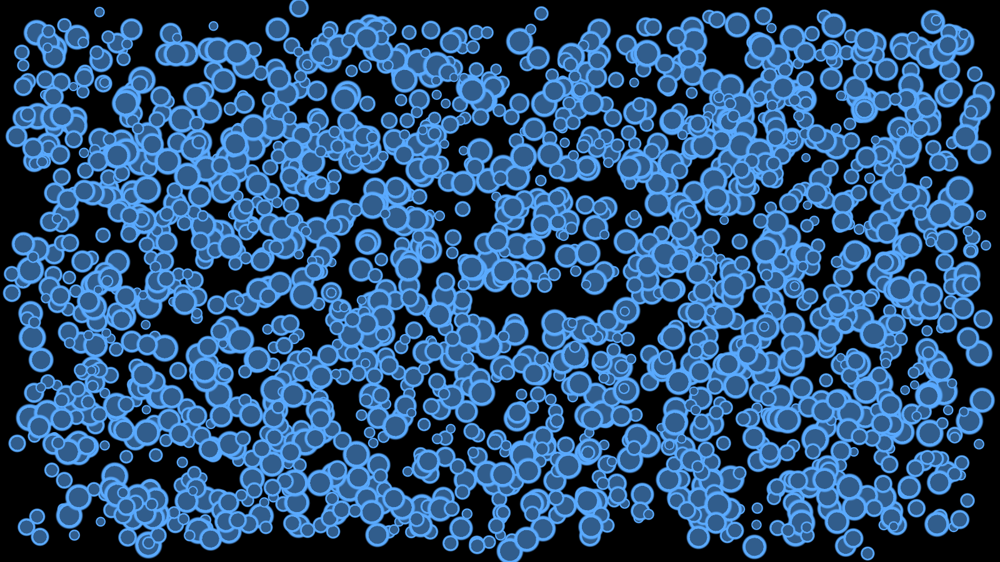
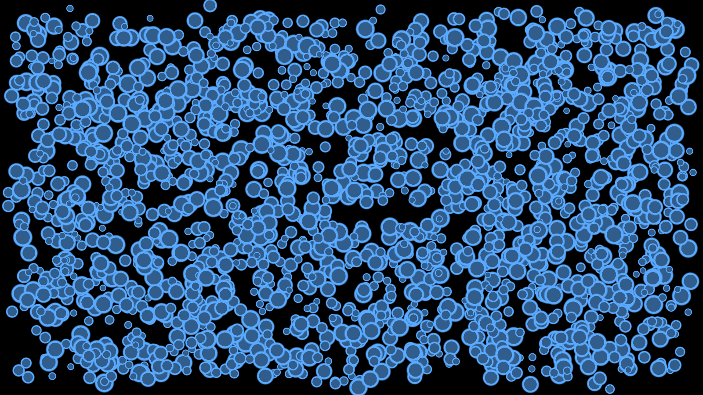

# Performance

Each platform has a pair of apps in one solution under `benchmarks/Performance/`. They draw the same
animated sprites, one with the engine alone and one through SkiaGameRendering:

- **Raw**: plain `SpriteBatch`. Skia is not loaded.
- **Skia**: one screen-sized `SkiaRenderTarget2D`, one `SKCanvas.DrawAtlas` per frame on a
  GPU-resident image, composited with `End()`. This is the recommended path from the README.

Both apps run with vsync and fixed timestep off. Frame time is wall-clock time between successive
`Draw` calls, so it covers the whole frame: update, draw submission, the Skia context switch and
flush, the composite, and `Present`. Nothing is excluded.

The scenes use sprites for now. Vector shapes (Skia against Apos.Shapes) come later.

## Running

Build the platform's solution in Release and run each exe. Each app runs through every scene
(2 s warmup, 5 s measured), shows the last second's FPS in the title bar, then exits. It writes
`perf-results-<app>.md` and `screenshots/` next to the exe. The results file records the commit,
OS, CPU, the GPU that actually ran, and whether the machine was plugged in.

```bash
dotnet build benchmarks/Performance/MonoGame.WindowsDX/Performance.MonoGame.WindowsDX.sln -c Release
```

Pass `--scene N` to hold one scene indefinitely instead of sweeping.

Laptops need to be plugged in and running the discrete GPU. On battery, or on the integrated GPU of
a hybrid-graphics laptop, results are not comparable with other rows. The results file shows both.

## Adding results

Run the Raw and Skia apps back to back on the same machine. Add the machine to the hardware table
if it isn't there, then add one row per scene to each platform's table. "Skia / Raw" is Skia FPS
divided by Raw FPS, so 100% means no overhead.

## Hardware

| ID | CPU | GPU | OS | Power |
|---|---|---|---|---|
| H1 | AMD Ryzen 7 260 (16 threads) | NVIDIA GeForce RTX 5060 Laptop GPU | Windows 11 (26200) | Plugged in |

## MonoGame DesktopGL

| Raw (SpriteBatch) | Skia (DrawAtlas) |
|---|---|
|  |  |

| Hardware | Date | Commit | Scene | Raw FPS | Skia FPS | Skia / Raw |
|---|---|---|---|---:|---:|---:|
| H1 | 2026-09-30 | 59d06ca | Sprites 0 | 2190 | 1830 | 84% |
| H1 | 2026-09-30 | 59d06ca | Sprites 500 | 2677 | 1440 | 54% |
| H1 | 2026-09-30 | 59d06ca | Sprites 2k | 2036 | 1327 | 65% |
| H1 | 2026-09-30 | 59d06ca | Sprites 10k | 672 | 573 | 85% |
| H1 | 2026-09-30 | 59d06ca | Sprites 50k | 151 | 159 | 105% |
| H1 | 2026-09-30 | 59d06ca | Tinted sprites 10k | 701 | 569 | 81% |

## MonoGame WindowsDX

| Raw (SpriteBatch) | Skia (DrawAtlas) |
|---|---|
|  |  |

| Hardware | Date | Commit | Scene | Raw FPS | Skia FPS | Skia / Raw |
|---|---|---|---|---:|---:|---:|
| H1 | 2026-09-30 | 59d06ca | Sprites 0 | 4003 | 3231 | 81% |
| H1 | 2026-09-30 | 59d06ca | Sprites 500 | 4224 | 2489 | 59% |
| H1 | 2026-09-30 | 59d06ca | Sprites 2k | 2749 | 1972 | 72% |
| H1 | 2026-09-30 | 59d06ca | Sprites 10k | 946 | 524 | 55% |
| H1 | 2026-09-30 | 59d06ca | Sprites 50k | 181 | 84 | 46% |
| H1 | 2026-09-30 | 59d06ca | Tinted sprites 10k | 877 | 589 | 67% |
